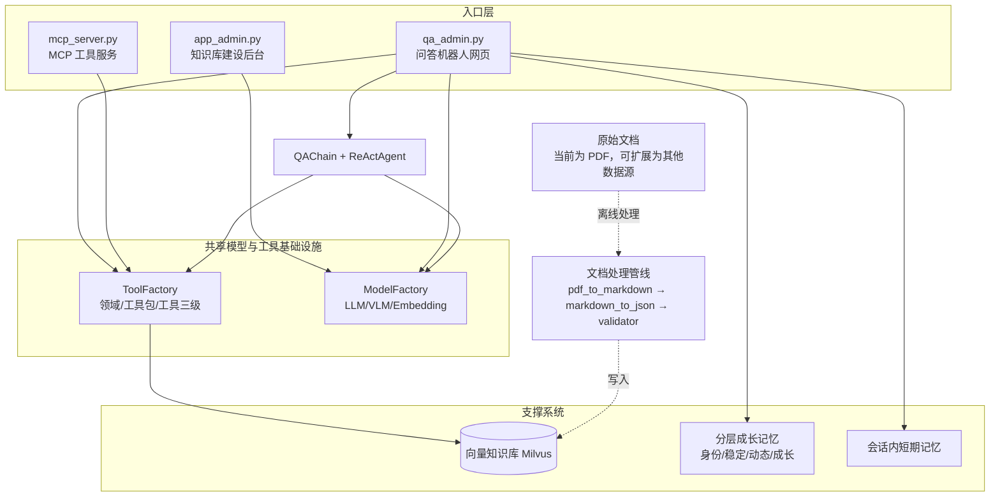

# Growlong

一套模块化智能问答系统，包含模型管理（`ModelFactory`）、分级工具管理（`ToolFactory`）、ReAct Agent、RAG 检索生成、会话记忆与成长型记忆。知识库建设后台、问答系统和 MCP 服务复用模型、工具及检索能力；系统还提供代码沙箱和内容合规检查。

## 系统设计优势

- **共享模型与工具基础设施**：`ModelFactory` 管理模型，`ToolFactory` 提供 Domain → Package → Tool 的三级工具注册；`qa_admin.py` 组装问答流程，`app_admin.py` 与 `mcp_server.py` 使用各自需要的能力。仓库当前没有独立的 `AgentFactory` 模块。
- **建库与问答解耦**：文档解析（VLM）→ Markdown → JSON 分块 → 校验 → 写入 Milvus 是一条独立的离线管线，问答机器人只负责检索与生成，两者可以分别迭代、分别扩容。PDF 只是当前落地的第一种数据源（也是最初用于验证管线的起点），向量库本身不绑定 PDF——任何能整理成文本分块的内容（网页、Word、数据库导出、API 返回等）都可以走同一条入库路径，只需替换 `data_prep/` 里的解析环节。
- **自研滑动窗口解析长 PDF**：`pdf_to_markdown.py` 没有直接把整份 PDF 丢给 VLM，而是用自研的滑动窗口机制分片识别，解决了长文档超出模型单次处理能力的问题；同时通过跨窗口的表格合并逻辑，修复了表格跨页断裂、无法被正确识别为同一张表的问题。
- **工具能力可对外复用**：`factory/tool_registry.py` 从 `config/tools.yaml` 动态注册工具；MCP 服务和 Agent 均可使用工具工厂中的工具。
- **记忆体追踪的是轨迹而非流水账**：`memory_growth` 把用户信息拆成身份（无轨迹，单独存 profile）、稳定语境（长期目标/能力树）、动态语境（当前偏好/卡点）、成长语境（前三层如何随时间演变）四层，渲染为 Prompt 注入 Agent——做到的是"共同成长"式的持续认知积累，而不只是更大的聊天记录库。这与会话内的短期记忆（`memory/`）是互补的两个时间尺度。
- **双重安全防护，分而治之**：代码类工具调用走 AST 静态审查 + 子进程沙箱隔离；文本类输入输出走正则脱敏 + LLM 语义二次审查。两条链路共用 `config/patterns.yaml` 规则源，但审查对象和执行方式完全独立，互不影响。
- **角色可见性配置**：当前 `config/tools.yaml` 在 Domain 层配置 `role_whitelist`；`ToolFactory` 提供按角色过滤 Domain 和工具的能力。
- **用户反馈闭环 + 运行观测**：`memory/feedback_store.py` 记录每次回答的 👍/👎 反馈，`api/observability.py` 定期聚合查询量、compliance 拦截率等基础运行指标。

## 系统架构



入口复用模型工厂和工具工厂，并连接向量知识库（供检索）与分层成长记忆（供跨会话用户认知）；安全防护由 Agent 安全模块和合规模块提供。

## 目录结构

```bash
agent_jerry_gao/
├── README.md
├── TESTING.md
├── Requirements.txt
├── app_admin.py / qa_admin.py / mcp_server.py
├── atomic_io.py
├── agent/                 # ReAct Agent、安全、沙箱与工具传输
├── api/                   # 可观测性
├── config/                # Python/YAML 配置，包括 tools.yaml
├── data_prep/             # PDF → Markdown → JSON 分块
├── eval/                  # 检索与生成评测脚本、样例及报告
├── factory/               # 模型、工具工厂/注册器及 factory/tools/
├── generator/              # LLM 客户端与问答链
├── ingest/                 # 数据校验与 Milvus 入库
├── memory/                 # 会话、实体、反馈及短期记忆
├── memory_growth/          # 成长记忆抽取、分层、渲染与路径管理
├── search/                 # 检索与重排
├── tests/                  # pytest 测试
├── utils/                  # 通用工具
├── tool幫助文檔.md
└── tool創建文檔.md
```
## 目录结构与模块职责

### 1) 入口层 / 应用层

| 目录/文件 | 职责 |
|---|---|
| `app_admin.py` | 知识库建设后台（Gradio）：负责文档解析、清洗、分块、校验与入库流程的管理入口 |
| `qa_admin.py` | 问答系统主后台（Gradio）：负责检索增强问答、记忆注入、合规审计、沙箱执行与用户鉴权 |
| `mcp_server.py` | 对外 MCP 工具服务入口：将内部工具能力暴露给外部 Agent |
| `api/observability.py` | 轻量级可观测性扫描：统计会话数、用户数、查询数、合规拦截数等指标 |

### 2) 文档处理与入库管线

| 目录/文件 | 职责 |
|---|---|
| `data_prep/pdf_to_markdown.py` | 使用 VLM 解析 PDF 为 Markdown，支持长文档滑动窗口识别与跨页表格合并 |
| `data_prep/markdown_to_json.py` | 将 Markdown 按标题/层级切分成结构化 JSON chunk |
| `ingest/validator.py` | 入库前校验：检查字段完整性、长度、结构合法性等 |
| `ingest/db_uploader.py` | 将向量和元数据写入 Milvus，并执行基础检索验证 |

### 3) 检索与生成链路

| 目录/文件 | 职责 |
|---|---|
| `search/retriever.py` | 基于 Milvus 的向量/关键词混合检索器 |
| `search/reranker.py` | 交叉编码器重排序模块，对候选结果做相关性过滤和排序 |
| `generator/llm_client.py` | 对底层 LLM 推理调用的统一封装 |
| `generator/qa_chain.py` | 端到端问答链：检索 → 重排 → 生成，并集成合规与超时控制 |

### 4) 三工厂底座

| 目录/文件 | 职责 |
|---|---|
| `factory/model_factory.py` | 模型与算力工厂：统一管理 LLM / VLM / Embedding 的加载和显卡分配 |
| `factory/tool_factory.py` | 同时定义 `BaseTool` 和三级工具工厂，负责注册、元数据导出与角色可见性 |
| `factory/tool_registry.py` | 工具注册初始化：从配置或具体实现模块加载工具到工厂体系 |
| `factory/tools/__init__.py` | 导出当前内置工具类 |
| `factory/tools/rag_tool.py` | 知识库检索工具：封装 RAG 检索能力供 Agent/MCP 调用 |
| `factory/tools/api_tool.py` | 仪表板/业务接口工具：封装外部 API 或内部看板查询能力 |
| `factory/tools/web_search_tool.py` | Web 搜索工具：用于补充外部互联网信息检索 |

### 5) Agent 层

| 目录/文件 | 职责 |
|---|---|
| `agent/react_agent.py` | ReAct Agent 主实现：两阶段路由、动态 Prompt 绑定、工具调用与推理循环 |
| `agent/react_agent_integrated(棄用).py` | 已弃用的集成版 Agent，不属于当前主线 |
| `agent/security.py` | AST 代码静态审查：限制危险导入、危险调用和属性访问 |
| `agent/sandbox.py` | 子进程隔离执行受限代码，增强工具调用安全性 |
| `agent/compliance.py` | 内容合规模块：正则脱敏 + LLM 语义二次审查 |
| `agent/tool_transport.py` | Agent 与工具之间的调度/转发层，负责工具调用传输 |
| `agent/transports/` | IPC、HTTP 和 gRPC 等传输实现 |

### 6) 会话记忆层

| 目录/文件 | 职责 |
|---|---|
| `memory/memory_manager.py` | 会话级记忆总控，统一编排短期记忆、实体记忆与历史存储 |
| `memory/short_term_memory.py` | 短期上下文窗口，用于当前对话轮次记忆 |
| `memory/entity_memory.py` | 实体抽取与实体级上下文维护 |
| `memory/chat_history_file.py` | JSON 文件形式的会话历史持久化 |
| `memory/feedback_store.py` | 用户反馈收集与存储 |

### 7) 成长型记忆层

| 目录/文件 | 职责 |
|---|---|
| `atomic_io.py` | 成长型记忆文件的原子写入与文件锁辅助工具 |
| `memory_growth/1_extractor.py` | 从会话历史抽取成长记忆事实 |
| `memory_growth/2_layer_mapper.py` | 将事实映射到分层语境结构 |
| `memory_growth/3_context_builder.py` | 将分层语境构建为 Prompt 上下文 |
| `memory_growth/path_config.py` | 成长型记忆路径配置 |
| `memory_growth/llm_guard.py` | 记忆流程中的 LLM 防护辅助 |
| `memory_growth/app.py` | 成长型记忆应用入口 |
| `memory_growth/context/` | 成长型语境落盘目录 |
| `memory_growth/context/users/` | 按用户隔离的成长语境数据目录 |
| `memory_growth/context/users/<user_id>/facts.json` | 事实抽取结果 |
| `memory_growth/context/users/<user_id>/layered_context.json` | 分层语境结构化结果 |
| `memory_growth/context/users/<user_id>/user_prompt_context.txt` | 渲染后的最终 Prompt 上下文 |

### 8) 配置层

| 目录/文件 | 职责 |
|---|---|
| `config/tools.yaml` | Domain/Package 元数据、工具模块映射、启用状态和 Domain 角色白名单 |
| `config/prompt_hub.yaml` | Prompt 模板中心 |
| `config/patterns.yaml` | 合规与安全正则规则 |
| `config/users_auth.yaml` | 用户鉴权配置 |
| `config/users/` | 用户级配置，例如 `admin_patterns.yaml` |

### 9) 测试与评估

| 目录/文件 | 职责 |
|---|---|
| `pytest.ini` | 配置 pytest 测试发现、仓库根目录导入路径、覆盖率参数和标记 |
| `tests/conftest.py` | 测试 fixture：设置 Mock 环境和客户端，并清理测试资源 |
| `tests/` 下其他测试文件 | 单元测试与集成测试入口，覆盖核心模块行为 |
| `eval/eval_retriever.py` | 检索器评估脚本：测试召回、MRR、延迟等指标 |
| `eval/eval_generator.py` | 生成质量评估脚本：使用 LLM-as-a-Judge 评估回答质量 |
| `eval/run_all_eval.py` | 一键执行检索 + 生成评估的总入口 |
| `eval/eval_dataset.json` | 评测样本数据集 |
| `eval/reports/` | 评测结果导出目录，包含 JSON/Markdown 报告 |

### 10) 文档与辅助说明

| 目录/文件 | 职责 |
|---|---|
| `README.md` | 项目总说明文档与架构说明 |
| `Requirements.txt` | 依赖清单 |
| `tool幫助文檔.md` | 已验证的三级工具系统注册 SOP |
| `tool創建文檔.md` | 新工具从设计到验证的实践指南 |
| `TESTING.md` | pytest 配置、命令和核心模块覆盖率报告 |

## 实际系统主线

如果按“运行主链路”看，这个仓库可以理解为：

### 1) 文档入库链路
`app_admin.py` → `config/config_loader.py` / `factory/model_factory.py` → `data_prep/pdf_to_markdown.py` → `data_prep/markdown_to_json.py` → `ingest/validator.py` → `ingest/db_uploader.py` → Milvus

### 2) 问答链路
`qa_admin.py` → `factory/model_factory.py` → `generator/qa_chain.py` → `search/retriever.py` → `search/reranker.py` → `agent/react_agent.py` → `factory/tool_registry.py`（`init_tools`）→ `factory/tool_factory.py` → `memory/memory_manager.py` / `memory/short_term_memory.py` / `memory/entity_memory.py` / `memory/chat_history_file.py` / `memory/feedback_store.py`

### 3) 外部工具服务链路
`mcp_server.py` → `factory/tool_registry.py`（`init_tools`）→ `factory/tool_factory.py` → `factory/tools/` 内置工具 → 对外暴露工具能力

### 4) 长期成长记忆链路
`memory_growth/1_extractor.py` → `memory_growth/2_layer_mapper.py` → `memory_growth/3_context_builder.py` → `memory_growth/path_config.py` / 根目录 `atomic_io.py` → `data/<user_id>/session_*.json` → `memory_growth/context/users/<user_id>/facts.json` → `memory_growth/context/users/<user_id>/layered_context.json` → `memory_growth/context/users/<user_id>/user_prompt_context.txt`

### 5) 可观测性与评测链路
`api/observability.py` → 扫描 `data/` 下的会话文件；  
`eval/eval_retriever.py` → `search/retriever.py` / `search/reranker.py`；  
`eval/eval_generator.py` → `generator/qa_chain.py` / `generator/llm_client.py`；  
`eval/run_all_eval.py` → 串联检索评测与生成评测并输出报告

### 6) 配置与规则链路
`config/prompt_hub.yaml` → 提供 Prompt 模板；  
`config/patterns.yaml` → 提供合规/安全规则；  
`config/users_auth.yaml` → 提供用户鉴权；  
这些配置被 `qa_admin.py`、`agent/compliance.py`、`agent/security.py`、`memory_growth/` 等模块共同使用

### 7) 工程支撑链路
`pytest.ini` → 配置 pytest 发现规则、仓库根目录导入路径与覆盖率参数；
`tests/conftest.py` → 为测试提供隔离环境、Mock 客户端及资源清理 fixture；
`README.md` / `TESTING.md` / `tool幫助文檔.md` / `tool創建文檔.md` → 提供使用说明、测试指南和工具开发说明；
`Requirements.txt` → 记录仓库依赖

## 测试与覆盖率

核心模块测试已经完成。以下为当前测试覆盖率报告明细（按单文件展示）；不据此推算或宣称整体/总覆盖率，整体数值以实际运行生成的 coverage 报告为准。

| 文件 | 覆盖率 |
|---|---:|
| `atomic_io.py` | 91% |
| `agent/sandbox.py` | 92% |
| `search/retriever.py` | 94% |
| `memory/entity_memory.py` | 96% |
| `generator/llm_client.py` | 96% |
| `memory/session_registry.py` | 96% |
| `agent/security.py` | 96% |
| `memory/memory_manager.py` | 97% |
| `factory/tool_registry.py` | 97% |
| `memory/chat_history_file.py` | 98% |
| `search/reranker.py` | 99% |
| `factory/tools/web_search_tool.py` | 99% |
| `factory/tool_factory.py` | 99% |
| `generator/qa_chain.py` | 99% |
| `factory/model_factory.py` | 99% |
| `agent/react_agent.py` | 99% |
| `__init__.py` | 100% |
| `agent/tool_transport.py` | 100% |
| `agent/transports/__init__.py` | 100% |
| `agent/transports/ipc_transport.py` | 100% |
| `config/config_loader.py` | 100% |
| `factory/__init__.py` | 100% |
| `factory/log_factory.py` | 100% |
| `factory/tools/__init__.py` | 100% |
| `factory/tools/api_tool.py` | 100% |
| `factory/tools/dataset_summary.py` | 100% |
| `factory/tools/rag_tool.py` | 100% |
| `generator/__init__.py` | 100% |
| `memory/__init__.py` | 100% |
| `memory/feedback_store.py` | 100% |
| `memory/short_term_memory.py` | 100% |
| `search/__init__.py` | 100% |
| `utils/__init__.py` | 100% |
| `utils/timeout_ctx.py` | 100% |

复现命令、覆盖率配置和报告边界说明见 [TESTING.md](TESTING.md)。

## 使用说明

### 1) 环境准备

```
git clone https://github.com/jerrygao0204/agent_jerry_gao.git
cd agent_jerry_gao
```

仓库依赖通过脚本内的 `install_package()` 自动安装，若你希望手动安装，可参考 `Requirements.txt`。

* * *

### 2) 启动服务

#### 启动知识库建设后台

```
python app_admin.py
```

#### 启动问答系统后台

```
python qa_admin.py
```

#### 启动 MCP 工具服务

```
python mcp_server.py
```

* * *

### 3) 数据处理

#### PDF 转 Markdown

```
python data_prep/pdf_to_markdown.py
```

#### Markdown 转 JSON

```
python data_prep/markdown_to_json.py
```

#### 说明

+   这一流程通常由 `app_admin.py` 串联管理
+   `pdf_to_markdown.py` 负责把原始 PDF 转为 Markdown
+   `markdown_to_json.py` 负责把 Markdown 按标题分块为结构化 JSON

* * *

### 4) 运行测试

测试目录为 `tests/`，使用 `pytest` 运行。项目已完成核心模块测试；覆盖率报告明细见[测试与覆盖率](#测试与覆盖率)及 [TESTING.md](TESTING.md)。

#### 安装依赖

```
pip install -r Requirements.txt
```

#### 执行全部测试及覆盖率报告

```
pytest
```

#### 执行指定测试文件

```
pytest tests/test_xxx.py
```

#### 执行指定测试用例

```
pytest tests/test_xxx.py::test_case_name
```

#### 说明

    +   `pytest.ini` 的 `pythonpath = .` 将仓库根目录加入 pytest 导入路径；`tests/conftest.py` 提供测试 fixture
+   `pytest.ini` 配置测试发现规则和默认覆盖率参数；详见 [TESTING.md](TESTING.md)
+   因此测试中可以直接导入项目内模块，例如：
    +   `from agent.compliance import ComplianceChecker`
    +     `from search.retriever import Retriever`
    +   `from factory.tool_factory import tool_factory`

* * *

### 5) 运行评测

评测目录为 `eval/`，主要包含检索评测、生成评测和总评测入口。

#### 运行检索评测

```
python eval/eval_retriever.py
```

#### 运行生成评测

```
python eval/eval_generator.py
```

#### 运行全链路评测

```
python eval/run_all_eval.py
```

#### 评测说明

+   `eval/eval_dataset.json` 是评测数据集
+   评测结果会输出到 `eval/reports/`
+   检索评测主要关注：
    +   Hit Rate
    +   MRR
    +   检索延迟
+   生成评测主要关注：
    +   Faithfulness
    +   Answer Relevance
    +   TTFT
    +   生成总延迟

* * *

### 6) 成长型记忆处理

#### 抽取历史事实

```
python memory_growth/1_extractor.py
```

#### 构建分层语境

```
python memory_growth/2_layer_mapper.py
python memory_growth/3_context_builder.py
```

#### 说明

+   `memory_growth/context/users/<user_id>/` 下会生成：
    +   `facts.json`
    +   `layered_context.json`
    +   `user_prompt_context.txt`
+   这些内容会被注入到问答系统的 Prompt 中，用于跨会话长期记忆

* * *

### 7) 使用建议

+   首次运行前，确认 `config/users_auth.yaml`、`config/patterns.yaml`、`config/prompt_hub.yaml` 已正确配置
+   如果路径包含硬编码项，记得根据实际部署环境调整
+   如果只想验证单元能力，优先运行 `tests/`
+   如果想验证整体效果，优先运行 `eval/run_all_eval.py`

## 记忆与安全机制详解

### 成长型记忆系统 (memory_growth)：追踪轨迹，而不只是记录

与 `memory/` 的会话内短期记忆不同，`memory_growth/` 负责跨会话的长期用户认知积累，核心设计是把用户信息按**能否体现变化轨迹**分层，而不是一股脑塞进同一个结构：

- **身份画像**（`identity_facts`：姓名、职业、所在城市等）——没有轨迹可言，单独存一份 profile，不进成长结构
- **稳定语境** ——长期目标、能力树，变化慢
- **动态语境** ——当前偏好、卡点、正在做的技术迁移，变化快
- **成长语境** ——记录前三层本身是如何随时间演变的，这是"成长"二字的落点

处理链路：

1. **历史会话** `data/<user_id>/session_*.json`
2. **事实抽取** `extractor.py` 的 `FactExtractor` 从会话中抽取事实，并把抽取水位线 `last_run_at` 记在 `facts.json` 的 `metadata` 字段里，避免重复处理；读取-抽取-写入整个流程通过 `atomic_io.py` 的 `file_lock_for` 加锁，写入用 `atomic_dump_json` 原子替换，避免并发运行或崩溃导致数据丢失/损坏
3. **四层语境映射** `layer_mapper.py` 将扁平事实映射进标准 schema（`user_profile` 静态画像 + 三层动态语境），写入 `layered_context.json`，支持增量合并与去重，同样接入了加锁+原子写
4. **语境渲染** `context_builder.py` 按 11 个模块做防御性渲染（处理空字段、字典列表、字符串列表等），产出 `user_prompt_context.txt`，最终被 `QAChain` 注入到系统提示词中，让 Agent 具备跨会话的持续用户认知
5. 路径统一由 `memory_growth/path_config.py` 与 `config/` 中的配置共同管理，支持按用户隔离与环境切换。

### Agent 安全防护：沙箱执行 + 内容合规

系统对「代码」和「文本」分别设置了独立的防护链路：

- **代码执行安全**（`agent/security.py` + `agent/sandbox.py`）：ReAct Agent 生成的代码工具调用先经 `ASTCodeChecker` 基于抽象语法树做静态审查（依据 `config/patterns.yaml` 中的导入/调用/属性白名单与黑名单过滤），通过后交给 `SandboxExecutor` 在独立子进程中执行，并施加超时控制，防止逃逸或长时间占用资源。
- **内容合规审计**（`agent/compliance.py`）：用户输入与模型输出文本会经过 `ComplianceChecker` 的双重审计——先用 `patterns.yaml` 中的正则规则做敏感信息脱敏，再触发一次 LLM 语义审查，判断是否放行或改用预设的兜底话术回复。

两条链路共用 `config/patterns.yaml` 作为规则来源，但审查对象和执行方式完全独立。

## 已知的有意排除项

- **路由置信度不足时的主动反问**：`react_agent.py` 两阶段路由在候选分差不明显时反问用户，而不是硬答——这个功能经评估后主动排除，原因是当前用户规模小、彼此可触达培训，用一份使用指南 + 用户培训替代运行时反问的收益更高，且当前部署条件下无法同时加载两个模型。相关测试（`tests/test_react_agent.py` 里依赖 `max_score_gap` 参数的用例）已标记 `@pytest.mark.skip` 并注明原因，不是遗留缺陷。

## 需要注意的现状

- **存储介质仍是 JSON 文件**：`memory/chat_history_file.py`、`memory_growth/` 已通过 `atomic_io.py` 解决了并发写坏、写入中途崩溃损坏文件的问题（原子替换 + 按路径加锁），但尚未替换为数据库，大规模并发或多进程部署前建议评估是否需要迁移。
- **`FeedbackStore` 的并发保护范围有限**：`memory/feedback_store.py` 用的是 Python `threading.Lock`，只保护同一进程内的线程并发，如果未来把服务改成多进程部署（如 `gunicorn` 多 worker），需要换成 `filelock.FileLock`，否则并发安全会悄悄失效。
- **依赖版本未锁定**：`Requirements.txt` 列出了依赖项但未固定版本号，建议在目标环境验证通过后用 `pip freeze` 锁定。
- **`users_auth.yaml` 当前为占位测试凭证**：仓库中的账号密码是开发测试用的示例数据，不代表真实生产凭证，正式对外使用前需要替换为真实、经过妥善管理的凭证。
